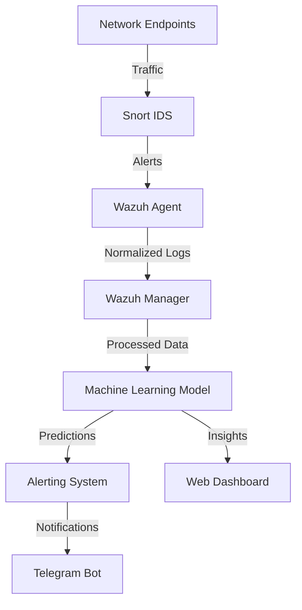

# Real-Time Network Log Analysis Using Artificial Intelligence

[](https://github.com/zezo0101/ML_N_IDS_WAZU_H/blob/main/LICENSE)
[](https://www.python.org/)
[](https://wazuh.com/)
[](https://www.snort.org/)

An AI-powered framework for real-time network anomaly detection by integrating Wazuh SIEM, Snort IDS, and machine learning.

## 📌 Project Overview

This project introduces an intelligent system that combines:
- **Wazuh** for log collection and management  
- **Snort** for signature-based intrusion detection  
- **Machine Learning** (SVM) for anomaly detection  
- **Telegram Bot** for real-time alerts  
- **Web Dashboard** for visualization  

Key capabilities:
- Real-time monitoring of network traffic  
- Detection of DoS attacks, port scanning, and Metasploit exploits  
- 96% classification accuracy with sub-second latency  
- Automated alerting via Telegram  
- Interactive web interface for manual analysis  

## 🛠️ System Architecture



## ✨ Key Features

### 🚨 Real-Time Threat Detection
- SVM model trained on simulated attack data (DoS, Port Scanning, Meterpreter)  
- Processes live network logs with <1s latency  
- 96% accuracy in classifying malicious traffic  

### 🔍 Comprehensive Monitoring
- Wazuh for centralized log management  
- Snort for rule-based detection  
- Custom feature extraction from network traffic  

### 📊 Visualization & Alerting
- Interactive web dashboard for traffic analysis  
- Telegram bot for immediate security alerts  
- Key metrics visualization (protocol usage, SYN/ACK ratios, etc.)  

## 📂 Repository Structure

```
ML_N_IDS_WAZU_H/
├── agent/                  # Snort agent implementation
│   ├── configs/            # Snort and Wazuh configurations
│   ├── scripts/            # Log conversion and monitoring scripts
│   └── ...
├── server/                 # Central server components
│   ├── ml_model/           # Trained SVM model and scaler
│   ├── alert_processor/    # Real-time classification
│   ├── web_app/            # Flask dashboard
│   └── ...
├── docs/                   # Project documentation
├── datasets/               # Sample network traffic data
└── ...
```

## 🚀 Getting Started

### Prerequisites
- Python 3.8+  
- Wazuh 4.3+  
- Snort 2.9+  
- Telegram Bot API key (for alerts)  

### Installation

Clone the repository:
```bash
git clone https://github.com/zezo0101/ML_N_IDS_WAZU_H.git
cd ML_N_IDS_WAZU_H
```

Install Python dependencies:
```bash
pip install -r requirements.txt
```

Configure Wazuh and Snort (see `docs/INSTALLATION.md`)  
Set up Telegram bot (edit `config/telegram.cfg`)  

### Usage

```bash
# Start the central server
python server/main.py

# Launch the web dashboard
python web_app/app.py
```

## 📊 Performance Metrics

| Metric            | Value  |
|-------------------|--------|
| Accuracy          | 96.2%  |
| DOS Recall        | 97%    |
| Meterpreter F1    | 94%    |
| Inference Speed   | 0.03s  |

## 📜 License

This project is licensed under the MIT License - see the [LICENSE](LICENSE) file for details.

## 👥 Team

- Ahmed Mohamed ELenbaby  
- Amir Ahmed Shehata  
- Israa Khaled Mohamed  
- Mariam Maged Mostafa  
- Zeyad Sherif Saber  

**Supervisor:** Dr. Elhossiny Ibraheim  
**Menoufia University - Faculty of Electronic Engineering**  
**Computer Science & Engineering Department**  
**Academic Year 2024/2025**
